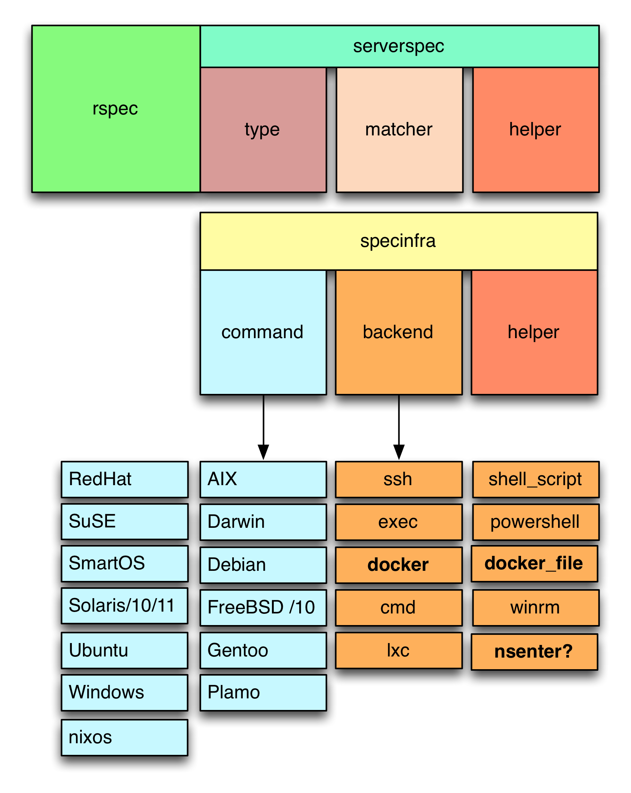

# Wait, what? Getting your bearings with ServerSpec

Hardy Pottinger

Digital Library Software Developer, UCLA Library

@fa[twitter] @hardy.pottinger

@fa[envelope] hpottinger@library.ucla.edu

Note:
Hi, welcome, thanks for coming.

---
# We are constantly learning more about our environment
* Developers shop jobs a lot
* Have you seen the mailing lists?
* We change jobs a lot
* Our jobs change a lot all on their own
* We are always the newbie

Note:
More spearker notes here.

---


Note:
So, here's a story I read a while back, maybe it'll sound familiar? You come in at a new job, you have the initial “Hey newbie, here’s your new network. You have web machines, databases, app servers, caching servers, configuration management and other boxes. We have process monitoring ...em... nagios... heh... and yes we have configuration management where you have to do code reviews to get anything out to production.” As a newbie I’m excited *this is great* but here comes the kicker. Your  trainer continues, “Ok, lets walk through each machine. There are 10 web servers, 9 of them are called www1 through www9, and one called paco.” You quickly grab a piece of paper, “Paco?”, “Yes the admin before you didn’t like standard names, he wanted to give machines ‘personality’, and we had a change after him, so we have that one off.”

---
# Why write tests?
## with ServerSpec or any similar tool?
* Tests are documentation
* Your team may or may not survive
* Provisioning tools come and go
* No matter what happens to the tools or your team, these tests will persist as documentation of your intentions and proof that the service is configured as you expected

Note:
More spearker notes here.

---
# ServerSpec
* Extension of RSpec
* Is a Ruby gem
* Is a great way to force yourself to think about your intentions before you provision a new service
* Is a great way to get to know your existing services

Note:
It's this last bullet that I want to focus on today. TDD is cool and I will point
out ways you can incorporate TDD to learn ServerSpec. But, the focus will be less
on creating new things and more on figuring out what has already been built.

---
# Software Reuse
* ServerSpec
* DockerSpec
* SpecInfra
¯\\_(ツ)_/¯
Note:
Details to follow, but there are a bunch of related and interdependent tools
This is the way the Ruby ecosystem works: developers keep leveraging other work
to do new things.

---
# Installing ServerSpec
* It’s a Ruby gem, you’ll need Ruby 2.0.x+ installed
sudo gem install serverspec
* You will need Rake installed, too:
sudo gem install rake
* You will need SSH access to the servers you want to check
* You will not need Sudo on these servers, though Sudo does make things slightly easier

Note:
Sudo: I will point out areas where things may get a little dicey if your test logs in as a normal user. It all works, but you have to adjust some tests for unprivileged users.

---
```
$ serverspec-init
Select OS type:
  1) UN*X
  2) Windows
Select number: 1
Select a backend type:
  1) SSH
  2) Exec (local)
Select number: 1
Vagrant instance y/n: n
Input target host name: waitwat
 + spec/
 + spec/waitwat/
 + spec/waitwat/sample_spec.rb
 + spec/spec_helper.rb
 + Rakefile
 + .rspec
```
@[14]
---
```
require 'spec_helper'
describe package('httpd') do
  it { should be_installed }
end

describe service('httpd') do
  it { should be_enabled }
  it { should be_running }
end

describe port(80) do
  it { should be_listening }
end

describe file(/etc/httpd/conf/httpd.conf) do
  it {should be_file}
  it {should contain "ServerName my-server-name"}
end
```
@[1] spec_helper
@[2-4] packages
@[6-9] services
@[11-13] ports
@[15-18] files

---
# Resources
https://serverspec.org/resource_types.html
* packages
* services
* ports
* files
* commands
* users and groups
* cron

---
# scaling up to more than one server

---
# spec_helper

---

ServerSpec Components, adapted from ["Introduction to Test-Driven Docker Development,"](https://entwickler.de/online/development/docker-test-driven-development-b-170207.html) by Peter Roßbach,  Wednesday, August 12, 2015, [Entwickler.de](https://entwickler.de/)

---
# gotchas


---
# containers? Docker?
Use DockerSpec


---
# Thanks! Questsions?

Slides: [github.com/hardyoyo/code4lib19-serverspec-workshop](https://github.com/hardyoyo/code4lib19-serverspec-workshop)
Credits:

Story of the newbie:
https://jjasghar.github.io/blog/2013/07/12/serverspec-the-new-best-way-to-learn-and-audit-your-infrastructure/
Note:
Thanks for coming! Any questions?
